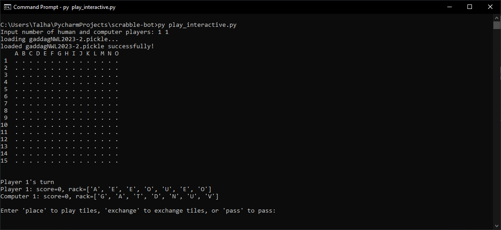

# Scrabble Bot
A GADDAG-based computer Scrabble player written in Python.

## Features

- A CLI to play full games of Scrabble
  - Can pit computers against each other or challenge them yourself
- The game of Scrabble recreated in Python
- An object-oriented implementation of the GADDAG data structure
- Move generation, validation, and evaluation algorithms

## Usage
Clone the repository:

`git clone https://github.com/taaziz1/scrabble-bot`

Create the GADDAG locally by running `gen_gaddag.py`:

`py gen_gaddag.py`

Start interactive mode to play against a computer or with other humans:

`py play_interactive.py`